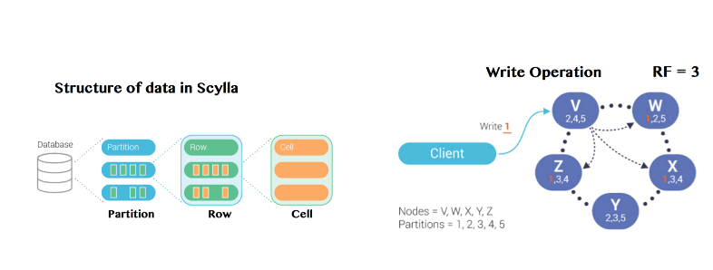
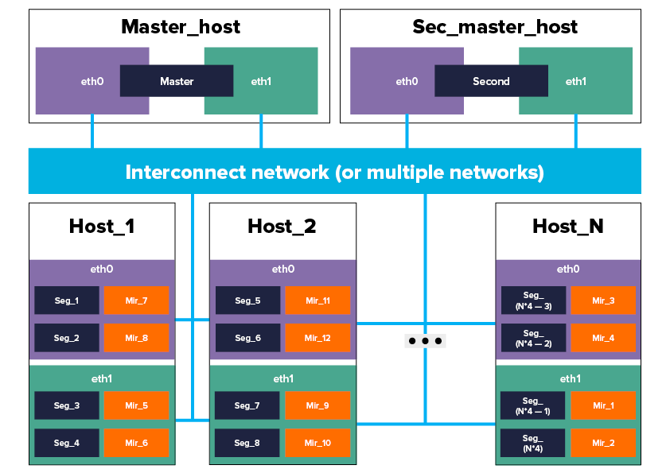

# ScyllaDB 
Узлы в ScyllaDB связаны кольцевым образом, в каждом из узлов есть ячейки, в которых содержиться информация. Например, посмотрим на рисунок:

Как мы видим, например, если мы захотим изменить данные в ячейке 1, которая лежит в узлах Z, X, W, то в случае, если у нас нарушена связь X-W, Z-V, Z-Y, то изменяя ячейку 1 в каждом из этих элементов, она не будет изменена в других, при этом доступ к системе будет, но при обращении в разные узлы мы будем получать разные данные о системе, а значит, будет нарушаться её целостность, исходя из этого нарушения, то по теореме CAP данная СУБД является AP системой.

# ArenadataDB
Классическая архитектура выглядит так.

В архитектуре присутствуют два сервера, один является мастером, другой является резервный.
Как мы видим, в каждом из сегментов содержится копия другого сегмента, это позволяет сохранять нам доступность к данным.
Если откажет какой-то из узлов, то запускаются Mirror сегменты и  все изменения таблиц и индексов записываются в файл только после их занесения в журнал (https://docs.arenadata.io/adb/index.html#:~:text=%D0%92%20%D1%81%D0%BB%D1%83%D1%87%D0%B0%D0%B5%20%D0%BE%D1%82%D0%BA%D0%B0%D0%B7%D0%B0,%D0%B7%D0%B0%D0%BD%D0%B5%D1%81%D0%B5%D0%BD%D0%B8%D1%8F%20%D0%B2%20%D0%B6%D1%83%D1%80%D0%BD%D0%B0%D0%BB), что позволяет сохранить целостность.

# DragonFly
DragonFly является высокопроизводительным хранилищем данных ключ-значение, на подобии Redis и Memcached, с которыми она совместима. Если построить систему так, что присутствует Master узел и распределить данные на нескольких узлах, то тогда система будет обладать целостностью, т.к. образуется модель Master-Slave. (А дальше не знаю. Вообще, если судить по лекции, то Redis и Memcached являются CP моделями, а значит, из-за совместимости с ним DragonFly, то и эта модель является CP)