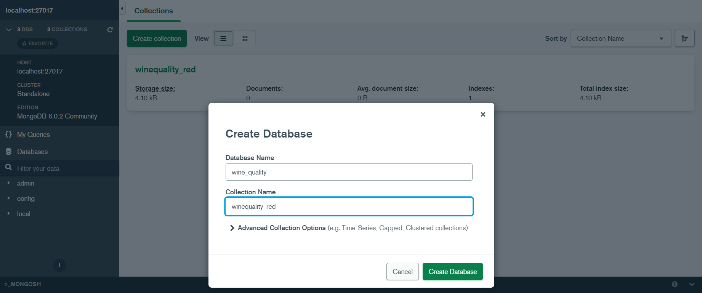

Для начала установим MongoDB под Windows. Для этого просто скачаем установщик с официального сайта (:

После установки подключимся к серверу, свойства которого определяются во время установки, используя MongoDB Compass.

Далее создадим базу данных, использую GUI.

Прежде чем работать с данными по белым винам, импортируем их в нашу базу данных и изменим тип всех признаков на соответствующий тип (в данном случае, я просто поставил у всех тип float)
Таким же образом импортируем файл с красными винами
Далее при помощи встроенной консоли переключимся на интересующую нас базу данных и посмотрим на первый найденный элемент в документе winequality_white

![Find one][UseDB.png]

Как мы видим, у вина есть множество различных характеристик, например такие как, например, доля спирта или кислотность. 
Давайте выполним более сложный запрос и узнаем какой количество вина из этого датасета с долей спирта меньше 10

![Complex expr][ww_find_it.png]

Как мы видим, белого вина с долей спирта меньше 10 примерно 39% от всего количество белого вина в датасете.

Давайте теперь изменим некоторую информацию о белом, а именно изменим качество алкоголя на 1, если доля спирта равна 10

![Set ][updateMany.jpg]

И теперь просто удалим поле с качеством, где доля спирта равна 10

![Unset][unsetMany.jpg]

Теперь посмотрим на то, как нам помагают индексы в плане производительности. Посмотрим, сколько документов обработается по запросу о количестве белого вина с долей спирта больше 10.
![Without index][withouIndex.png]

Как мы видим, было обработано 4898 документов.
Теперь создадим индекс, и посмотрим, сколько будет обработано по такому же запросу.
![With index][withIndex.png]

Как мы видим, количество обработанных документов сократилось до 2813. Почти что в половину!